# Notes

## 2.2

- The application layer in the TCP/IP model is the interface that prepares our communication for trasmission over the computer networks

- Sockets are identified by an IP:PORT
- for client-server communication, thre should be two sockets involved (one socket on each side).
- physical, link, network & transport layers and managed by the OS
- between the transport and the application layer sits the socket API.
- 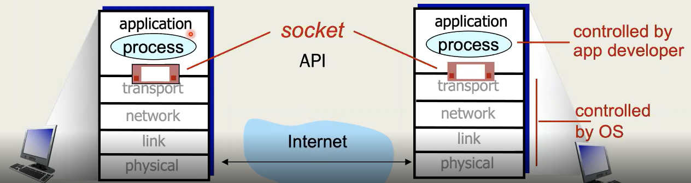

- To use a socket, you need to decide what transport layer protocol to use
- This can be either TCP or UDP

The table below has been yoinked from the lecture video into chatgpt to generate a table in markdown with the RFC specification documents properly linked.

| Application            | Application-layer protocol                                                                                                                               | Transport-layer protocol                                                                                                     |
| ---------------------- | -------------------------------------------------------------------------------------------------------------------------------------------------------- | ---------------------------------------------------------------------------------------------------------------------------- |
| File transfer/download | [FTP — RFC 959](https://www.rfc-editor.org/rfc/rfc959.html)                                                                                              | [TCP — RFC 9293](https://www.rfc-editor.org/rfc/rfc9293.html)                                                                |
| E-mail                 | [SMTP — RFC 5321](https://www.rfc-editor.org/rfc/rfc5321.html)                                                                                           | [TCP — RFC 9293](https://www.rfc-editor.org/rfc/rfc9293.html)                                                                |
| Web documents          | HTTP/1.1 — [RFC 9110: HTTP Semantics](https://www.rfc-editor.org/rfc/rfc9110.html) and [RFC 9112: HTTP/1.1](https://www.rfc-editor.org/rfc/rfc9112.html) | [TCP — RFC 9293](https://www.rfc-editor.org/rfc/rfc9293.html)                                                                |
| Internet telephony     | [SIP — RFC 3261](https://www.rfc-editor.org/rfc/rfc3261.html), [RTP — RFC 3550](https://www.rfc-editor.org/rfc/rfc3550.html), or proprietary protocols   | [TCP — RFC 9293](https://www.rfc-editor.org/rfc/rfc9293.html) or [UDP — RFC 768](https://www.rfc-editor.org/rfc/rfc768.html) |
| Streaming audio/video  | [HTTP — RFC 9110](https://www.rfc-editor.org/rfc/rfc9110.html), [MPEG-DASH — ISO/IEC 23009-1](https://www.iso.org/standard/89027.html)                   | [TCP — RFC 9293](https://www.rfc-editor.org/rfc/rfc9293.html)                                                                |
| Interactive games      | World of Warcraft, first-person shooters and other proprietary protocols                                                                                 | [UDP — RFC 768](https://www.rfc-editor.org/rfc/rfc768.html) or [TCP — RFC 9293](https://www.rfc-editor.org/rfc/rfc9293.html) |

## 2.3

- The application layer protocols are essential.

## 2.4

- HTTP/1.1 - [RFC 2616](https://datatracker.ietf.org/doc/html/rfc2616)
- HTTP/2 - [RFC 7540](https://datatracker.ietf.org/doc/html/rfc7540)

request structure:
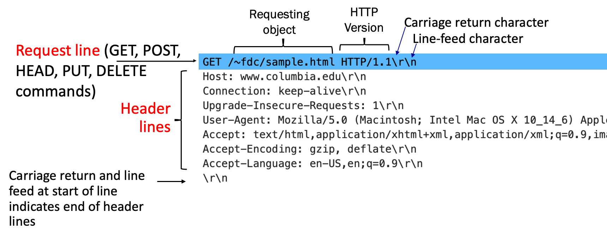

response structure:
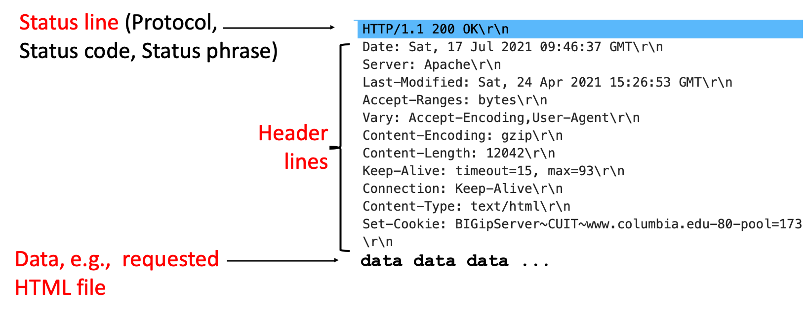

# Exercises

## Exercise 2.2.1

Client-server architechture:
- A web application/server uses a client-server model. 
- The client sends an HTTP request.
- The server will listen on a TCP socket, proecess the recieved request through the application layer and will return an HTTP response.
- TLS is used to ensure confidentiality, integrity and server authentication when HTTPS is used. 
- The web server might also communicate with other services like APIs, database servers, authentication providers, etc... 
- This architechture allows the administrators to have centralized logging, data stores and app states.

Peer to peer architechture:
- BitTorrent is a decentralized p2p file distribution protocol where each of its "nodes" (devices in the network/swarm) can operate either as a client or a server.
- Each file being shared is fixed into small pieces (chunks) allowing peers to download them simultaneously from multiple services and recreate the file at the every end.
- Because of this architechture, it allows nodes even without the full file to still share the chunks they have.
- When exchanging these files, peers use rarest file selection algorithms and a lot of other techniques to select which chunks to download the first.
- Trackers with distributed hash tables are used to discover peers, while the actual transfer happens between the peers directly.
- The more devices in the swarm, the more reliable and fast the file distribution will become.

## Exercise 2.2.2

- I use `ping` everyday for basic troubleshooting. It uses the ICMP protocol - the ICMP Echo Request (type 8) and ICMP Echo Reply (type 0) to be specific. And, ICMP is a network layer protocol. Therefore, this cannot be included here. https://stackoverflow.com/a/19218648
- In general day to day web browsing, we use HTTP and HTTPS. This traffic usually uses TCP but HTTP3 uses QUIC over UDP. https://www.f5.com/glossary/quic-http3 
- For emails, application layer protocols like SMTP and IMAP are used with TCP as the transport layer protocol.
- For DNS lookups, we usually use UDP (53/udp). Sometimes, there might also be a TCP fallback.
- SIP (Session Initiation Protocol) is mainly used in VoIP and calls and it usually uses UDP, however, we can also configure it to use TCP if required.

## Exercise 2.4.1

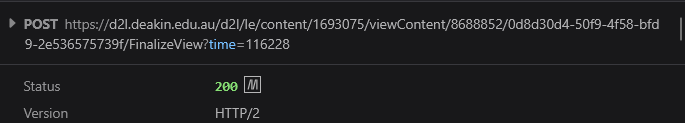

My browser uses persistant HTTP connections. Instead of creating a new connection for every object, it simply reuses an already established connection when having to deal with multiple HTTP requests and responses. 

HTTP 1.1 uses persistant connections by default. HTTP 2 can multiple multiple request-response streams over one TCP connection and HTTP 3 also provides a similar multiplexing capability over QUIC. Therefore, modern browser traffic is generally persistent unless the server explicitly closes the connection or doesn't support connection reuse.

Multiplexing allows several HTTP requests to be sent over the same connection at the same time and their responses can arrive in any interleaved order. This is used by both HTTP 2 and 3 to ensure that one slow response doesnt completely block everything else.

## Exercise 2.4.2

- GET: retrieves a resource
- POST: sends data to the server for processing. Very commonly used for form submissions, authentication, file uploads, and similar actions.
- PUT: create or fully replace an existing resource
- PATCH: update a resource without replacing everything
- DELETE: remove a resource
- HEAD: works like GET but will only return the response headers and not the response body.
- OPTIONS: request information about methods and features supported by a server (or a resource)
- QUERY: perform a read only server side query with the query parameters in the request body. introduced in June 2026 in [RFC 10008](https://datatracker.ietf.org/doc/html/rfc10008). 

## Exercise 2.4.3

Command to run is: `curl -sI -L <URL>`.
Based on https://stackoverflow.com/a/4497786

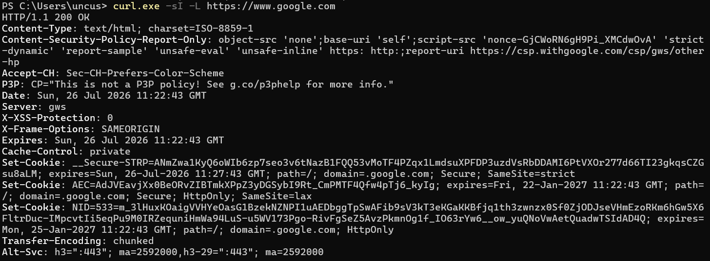

This command displays all the headers. Since we want to filter out cookie details, I will just grep it / use `findstr`.

Three cookies set from google.com. There are three cookies.
- __Secure-STRP
    - has not been documented officially but seems to be something security related and expires within 5 minutes.
    - Response was generated at 11:26:45 GMT and expires at 11:31:45 GMT.
    - Cookie will only be sent during same site interactions. It won't be sent when user visits google from another site to protect against XSS attacks.
    - Might be accessible via document.cookie.
- AEC
    - Used to detect spam, fraud and abuse by google. 
    - Expires in 22 January 2027, 11:26:45 GMT
    - Secure: Only sent through HTTPS
    - HttpOnly: not accessible via document.cookie
    - SameSite=Lax: generally blocked from cross site subrequests. However, it might still be available if the user directly goes to google through a normal top level link. 
    - Path=/: applies to every URL path under the specified domain.
- NID
    - Used to store user preferences and to support with analytics and advertising.
    - It's HttpOnly.
    - However, it doesn't have the Secure attribute set. This means the cookie is not restircted to HTTPS - but google uses HTTPS and HSTS. 
    - Has no SameSite attribute explicitly set, but by default, chromium treats this as SameSite=Lax. https://privacysandbox.google.com/cookies/basics/cookie-attributes

Functionalities of these cookies can be found here: https://policies.google.com/technologies/cookies

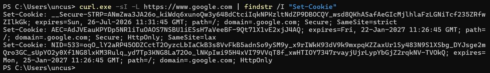

However, with amazon, at first, the response was a "503 Service Temporarily Unavailable".
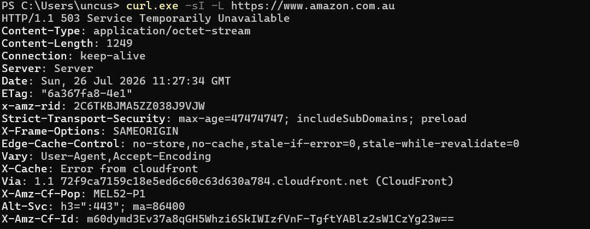

Next, I attempted it with a user agent and I got a "405 Method Not Allowed". The only allowed methods here are "GET, POST, PUT, DELETE, OPTIONS" as seen below.
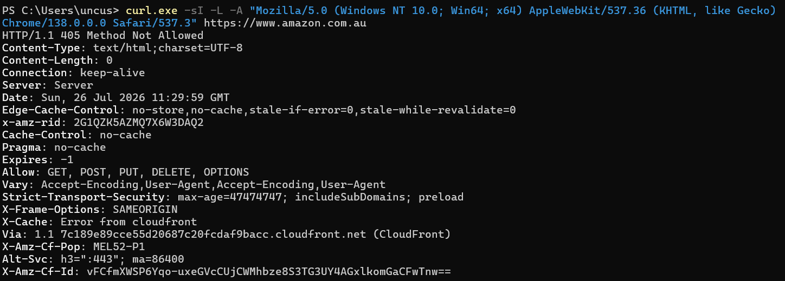

## Exercise 2.6.1

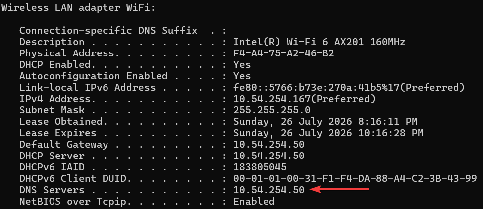

## Exercise 2.6.2

- User enters www.nasa.gov in their browser.
- Browser auto converts it to `https://www.nasa.gov`
- Browser checks the cache, cookies, HSTS and existing connections.
- DNS resolves www.nasa.gov to an IPv4/v6 address.
- Client uses ARP (IPv4) / NDP (Neighbor Discovery Protocoll for IPv6) to find the local routers MAC address
- The packet is sent through the router, ISP and internet to NASA's CDN/server.
- The router may perform NAT and firewall checks.
- The client then starts the TCP connection
    - TCP three way handshake happens for HTTP 1.1 and 2.
    - QUIC over UDP is used for HTTP 3.
- The TLS handshake occurs.
    - Browser sends `ClientHello`
    - Server sends certificate and cryptographic information.
    - The browser verifies this certificate.
    - Encryption keys will be created.
- Browser will send an encrypted HTTP `GET /` request.
- NASA's CDN/server processes the request.
- Server sends the HTML response back.
- Browser decrypts this and decompresses this response
- Browser parses the HTML
- Browser requests extra files (css, js, images, fonts, etc...)
- Additional HTTP requests may get sent to other domains following the same process too.
- Browser builds the page layout / DOM and renders it on the screen. 

# Self Assessment

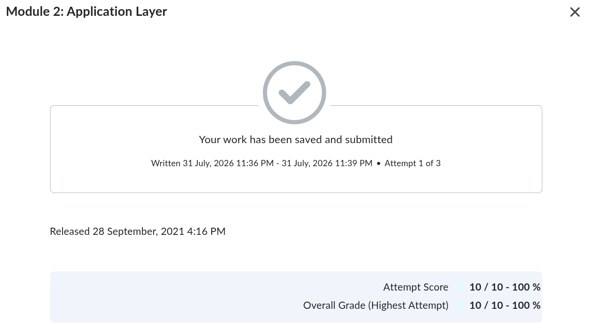

# Workshop

## Activity 2.2

1. Why do we need application layer protocols?

- It defines how applications communicate over a network.
- They specify the message format, syntax, semantics and timing.
- They enable interoperability between clients and servers.

2. Discuss some examples of application layer protocols.

- HTTP(S): web communication
- DNS: domain name to ip resolution
- SMTP: send emails
- IMAP/POP3: receive emails
- FTP/SFTP: file transfer
- DHCP: host configuration
- SSH: secure remote access

3a. HTTP is a client-server protocol. Can you identify the key features of HTTP?

- It's a client server and request-response protocol. 
- The client is usually a web browser and it sends a request to the web server and the server returns a response.
- HTTP is a stateless protocol. The server does not automatically remember the precious requests from the same client.
- As a workaround for this, we use sessions and cookies to maintain the state.
- It supports multiple methods like GET, POST, DELETE to do various sorts of things.

3b. Identify a group member who could act as a web server and other three members can act as clients. So, your network has one server and three clients.

For this, a group needs 5 people. I'm doing this by myself. Therefore, I will just visualize this.

3c. Let’s assume each client wants to access a web page stored in the web server and we use HTTP to communicate in the application layer level. You can now act as a server-client model communicating the right messages between each entity in sequence to get the information that each client wants. For example, Client 1 could say: "Client 1 initiating TCP connection with the Server". Then, the server replies with the correct response. You need to note down the correct messages in sequence.

- The client resolves the web serverss' IP using DNS
- The client starts a TCP connection with the server by sending a `SYN`
- The server replies with a `SYN-ACK`
- The client sends back `ACK` to complete the TCP three way handshake.
- If HTTPS is being used, the client and the server will then complete the TLS handshake.
- Once all the initial setup is done, the client will send an HTTP request like `GET /module2 HTTP/1.1`.
- After that, the server will resond with something like `HTTP/1.1 200 OK`
- The response will contain the HTTP web page, and based on the links here, the client browser might send more GET requests (sometimes from other domains, doing this process all over again) to fetch other CSS, JS, images, etc...

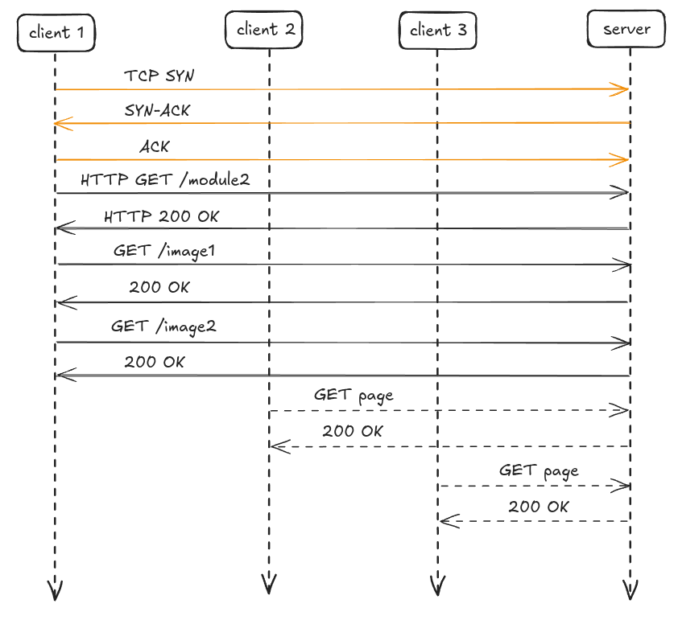

A proxy server / web cache sits between the real client and the web server. Instead of the client directly requesting resources from the web server, the request will first go through the proxy. This way, if it has something that it requested before, it can reuse them now. THis will help reduce the load to the web server, the loading times, bandwidth usage, and many other system resources. Proxy servers can also be used for logging and access control. 

I have personal experience setting up Squid cache for a Discourse instance, and when done right, it reduced the requests sent to the web server by around 40 percent.

When a client requests and object, the proxy server will first check whether it already has a valid copy stored in its cache. If its available, its called a cache hit and the proxy server will return this object directly to the client. If its not available, its called a cache miss and the proxy will forward this request to the web server, will recieve the object and and then send it back to the client, and it will also store it for future requests it might recieve (based on the HTTP caching headers).

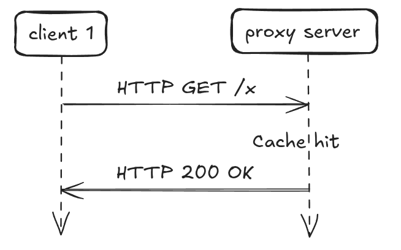

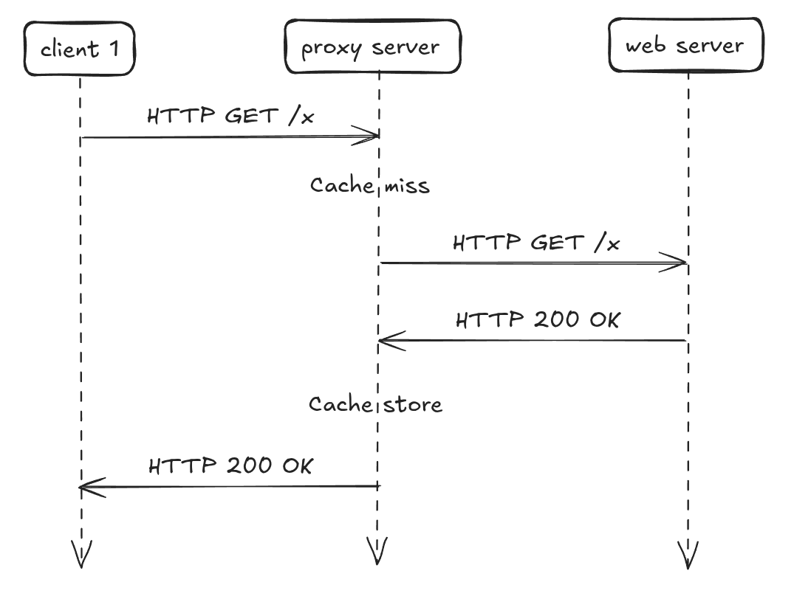

## Activity 2.3

Visiting `http://www.bom.gov.au/` redirects you (301 Permanent Redirect) to the https version of that. As it uses TLS, the response's contents won't be readable.

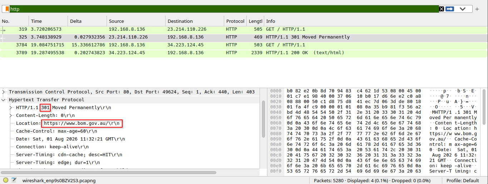

Therefore, I visited the popular `http://neverssl.com/` website. The packet capture can downloaded here: https://drive.google.com/file/d/1H0wq0Hr-HlefHglHEn27XEQc0Dsppj4l/view?usp=sharing 

In the screenshot below, you can clearly see the `GET` request, the Request Version, `Host`, `User-Agent` and the `Connection` type. 

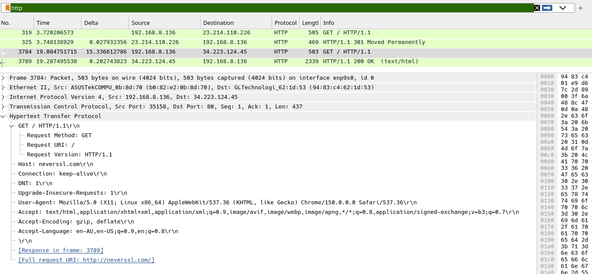
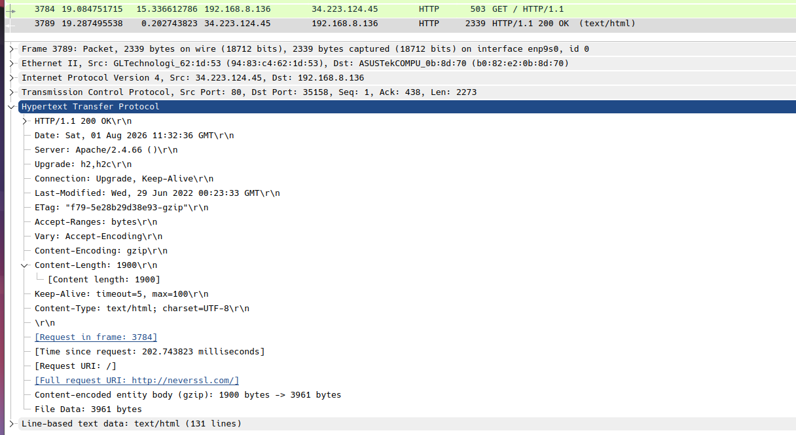

You can see the Ethernet II details.

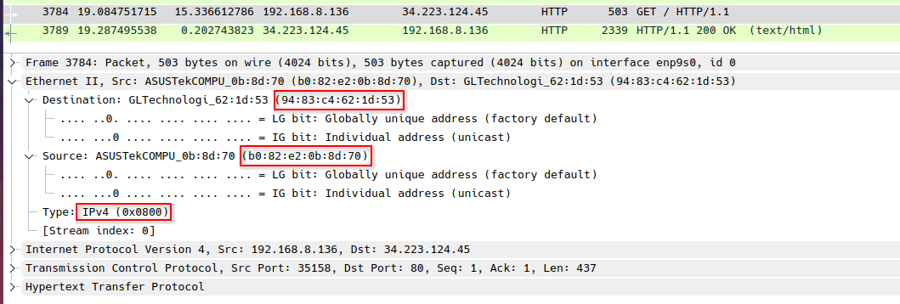
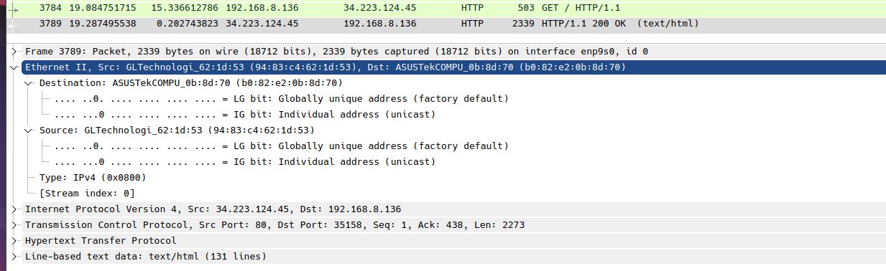

Below are the IPv4 information.

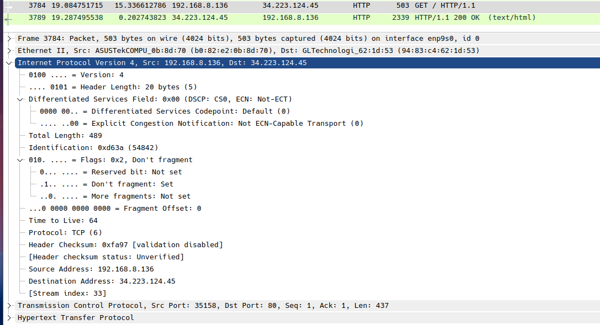
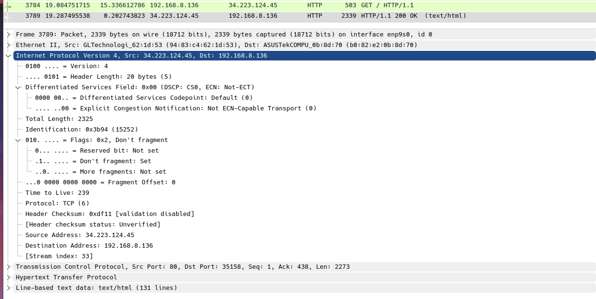

Below are the TCP related information.

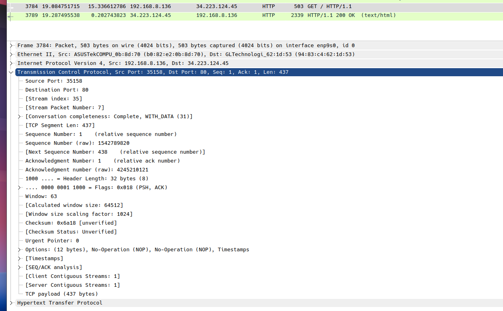
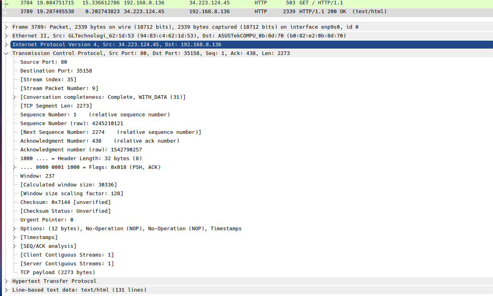

